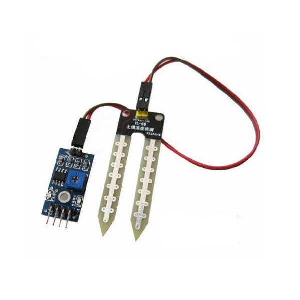
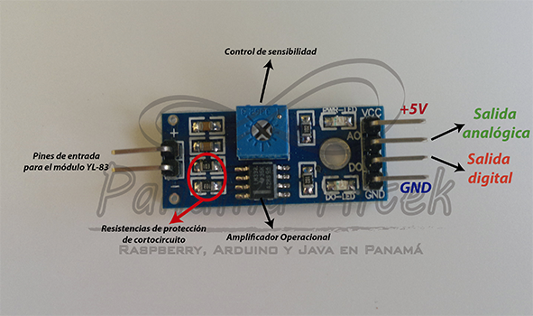

#RESUMEN Sensor HL-69

##Funcionamiento

El funcionamiento se basa en medir un potencial eléctrico como resultado de la circulación de corriente eléctrica entre los extremos de la sonda. En general, la composición de la tierra en conjunto con el agua forman una masa capaz de conducir ciertas cantidades de corriente eléctrica; esta corriente eléctrica es proporcional a la conductividad del medio y ésta conductividad será mayor cuanto mayor sea la proporción de agua en la mezcla. De igual forma, una conductividad menor significa que hay poca intensidad de corriente eléctrica o sea que hay una mayor resistencia a la circulación de corriente eléctrica.

El potencial eléctrico obtenido a la salida del circuito adpatador será proporcional a la resistencia que el suelo ofrezca a la circulación de la corriente eléctrica. El potencial eléctrico del adaptador se aplica a una de las entradas del conversor Analógico / Digital (ADC) y se obtienen lecturas en el rango 0-1023 dependiendo de la resistencia eléctrica del suelo que es, a su vez, inversamente proporcional a la cantidad de humedad.

##Componentes

Conjunto

Adaptador

##Diagrama de conexión

##Programa de prueba

