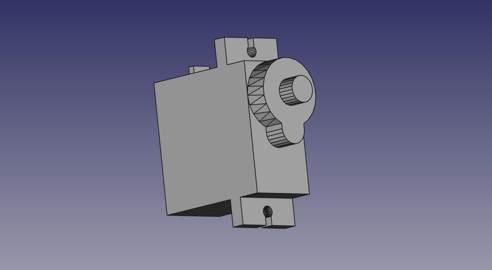

#RESUMEN Diseño de un actuador para control de flujo de agua

##Herramienta de diseño FREECAD

[Sitio del proyecto FREECAD](http://www.freecadweb.org/)

##Vistas de las piezas

Modelo físico Servo motor SG90

Soporte del Servo y leva

